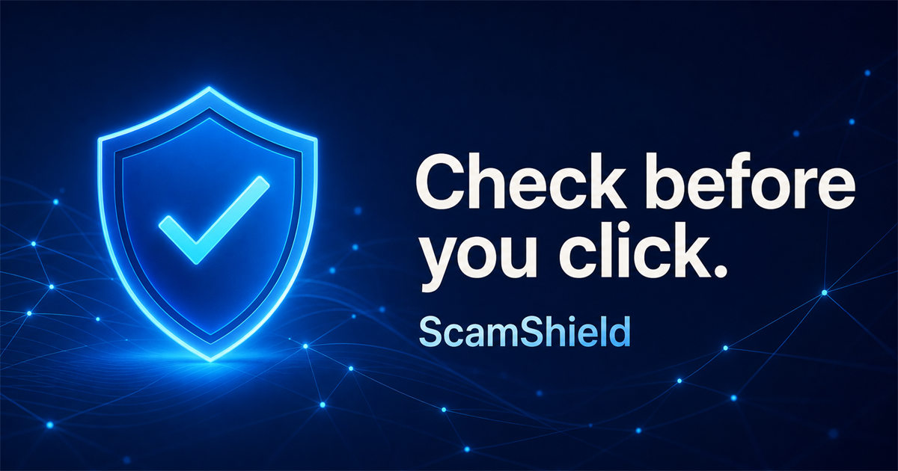

# ScamShield

ScamShield is a responsive web application that helps people assess suspicious messages, links, screenshots, and QR codes. It provides an understandable risk classification, explains the warning signs it found, and recommends practical next steps.



## Live demo

[Open ScamShield](https://scamshield-check-safe.spoukihome.chatgpt.site)

> ScamShield provides recommendations, not guarantees. A low-risk result does not prove that content is legitimate.

## Features

- Text and URL scam analysis with explainable rule-based scoring
- Clear **Safe**, **Suspicious**, and **Dangerous** classifications
- Risk scores from 0 to 100 with detected warning signs
- URL checks for insecure HTTP, shortened links, IP-based links, suspicious domains, and dangerous file extensions
- Detection of urgency, threats, credential requests, fake prizes, payment requests, impersonation, and high-risk offers
- Image upload flows for screenshots and QR codes with type and size validation
- Downloadable and shareable security reports
- Helpful / incorrect-result feedback controls
- Educational guides and an interactive scam-awareness quiz
- Searchable community scam-pattern examples
- English, French, Arabic, and Algerian Darija language modes
- Right-to-left layout support for Arabic
- Responsive layouts for mobile, tablet, and desktop
- Privacy and limitation notices throughout the product

The rules include locally relevant scam patterns involving Algérie Poste, BaridiMob, Edahabia, Mobilis, Djezzy, Ooredoo, parcel delivery, visas, scholarships, remote jobs, Facebook Marketplace, and WhatsApp account theft.

## Tech stack

- React 19
- TypeScript
- Vinext / Vite
- Tailwind CSS 4
- Cloudflare Workers-compatible Sites deployment

## Getting started

### Requirements

- Node.js 22.13 or later
- npm

### Installation

```bash
git clone https://github.com/spoukidev/Secure_Link.git
cd Secure_Link
npm install
```

### Development

```bash
npm run dev
```

Open [http://localhost:3000](http://localhost:3000) in your browser.

### Production build

```bash
npm run build
```

## How the analysis works

ScamShield uses independent detection rules instead of relying entirely on an AI model. Each matched signal contributes to the risk score. The report always pairs the score with explanations and recommended actions.

The current detector checks for:

- Pressure, fear, urgency, and threatening language
- Requests for passwords, PINs, OTPs, and payment details
- Fake prizes, jobs, scholarships, visas, and delivery notices
- Requests to send money or pay unexpected fees
- Impersonation of trusted organizations
- HTTP links, shortened URLs, raw IP addresses, unusual domains, and risky extensions
- Aggressive formatting commonly used in scam messages

URLs are analyzed separately from message language. This prevents legitimate domain or path words—such as `pin` in a Pinterest URL—from being mistaken for a request to share a banking PIN.

## Project structure

```text
app/
  layout.tsx       Site metadata and document layout
  page.tsx         Application UI, detection rules, and interactions
  globals.css      Global design system and responsive styles
  components.css   Extended component and report styles
public/
  favicon.svg      Site icon
  og.png           Social sharing image
.openai/
  hosting.json     Sites deployment configuration
```

## Privacy and security

- Basic analysis requires no account.
- The interface states that submissions are not stored permanently.
- Uploaded files are restricted to PNG, JPEG, and WEBP images under 5 MB.
- Suspicious URLs are parsed as text and are never opened on the user's device.
- Community examples are anonymized patterns and do not display personal information.

For a production service that accepts real uploads or stores community reports, add server-side validation, rate limiting, temporary-file cleanup, abuse controls, and a persistent database before enabling those capabilities publicly.

## Current scope

This repository contains a functional front-end MVP with local, rule-based analysis and realistic demonstration data. Screenshot OCR, QR decoding, server-side analysis, PostgreSQL-backed community reporting, and external URL-reputation services are natural next steps for a full production deployment.

## Contributing

Issues and pull requests are welcome. When changing detection rules, test both malicious examples and legitimate content to avoid false positives.
